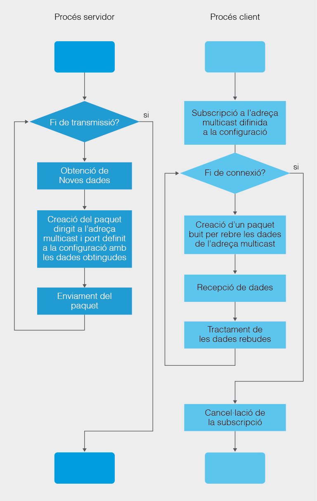

#### 3.3.3.2  Multicast UDP (User Datagram Protocol) 

Les aplicacions que necessiten transmetre informació a múltiples dispositius hauran d’escollir el protocol UDP, amb el risc de pèrdua d’informació que això suposa.

Adicional als sòcols amb datagrames en UDP, la classe **java.net** inclou una classe específica per a fer enviaments en broadcast o difusió, en concret permet l’enviament de datagrames a adreces multicast. Aquesta classe és MulticastSocket i es basa en l’ús d’adreces multicast.

Una **adreça multicast** no obeeix al format típic de classes A, B o C on hi ha una part que identifica a la xarxa i altra que identifica al host. Son adreces on les 32 bits identifiquen a una agrupació d’equips, no a cap equip en particular i, per tant, no son comparables amb les anteriors. 

Un router, en detectar l’enviament d’informació dirigida a una adreça broadcast, replicarà el paquets rebuts a totes les IP associades a l’adreça multicast. L’objectiu d’aquest mecanisme és reduir el trànsit dins d’una xarxa.

Les adreces multicast compren totes les adreces que es troben al rang \[224.0.0.0 \- 239.255.255.255\]. En altres paraules, la característica principal de les adreces **multicast** és que permeten a dispositius subscriure’s i per tant formar part d’una agrupació de difusió. Tot aquell dispositiu que estiga subscrit a l’adreça multicast rebrà les dades enviades per difusió a eixa adreça.


**MulticastSocket ([API](https://docs.oracle.com/javase/10/docs/api/java/net/MulticastSocket.html))**

Abans entrar en particularitats de la classe i de la seua utilització, cal dir que, al ser enviament en UDP, els sòcols multicast usen el DatagramPacket que s’ha vist a la quinzena anterior per a l’enviament  i recepció de paquets del protocol UDP. En altres paraules, l’ús de la classe MulticastSocket és molt semblant a la classe DatagramSocket, pel que fa a la recepció i l’enviament de dades perquè ambdos instancien els paquets com a objectes DatagramPacket i fan servir el protocol UDP per a la transmissió.

L’ús habitual d’enviaments Multicast és aquell en què un servidor disposa de les dades que requereixen els clients i aleshores, en un determinat moment, quan el servidor Multicast realitza l’enviament de les dades, tot aquell client subscrit a l’adreça multicast rebrà les dades enviades pel servidor. En aquest sentit, el/els clients es limiten a escoltar i processar les dades rebudes.

Important destacar que als sòcols Multicast han de treballar tots en el mateix port de comunicació independentment de si actuen com a clients o servidors.

| Mètodes de MulticastSocket | Descripció |
| ----- | ----- |
| MulticastSocket() MulticastSocket​(int port) MulticastSocket​(SocketAddress bindaddr) | Constructors MulticastSocket. Pot incloure un port o no. En cas que l’incloga, es vincula el sòcol a eixe port, en cas contrari, s’assigna un temporal lliure. Es pot assignar a un sòcol en particular. |
| void     joinGroup​(InetAddress mcastaddr) void     joinGroup​(SocketAddress mcastaddr, NetworkInterface netIf) | Acció d’unir-se a una adreça multicast.  També permet la subscripció de l’adreça multicast associada a una interfície de xarxa. |
| void     leaveGroup​(InetAddress mcastaddr) void     leaveGroup​(SocketAddress mcastaddr, NetworkInterface netIf) | Acció de desunir-se a una adreça multicast.  També permet la cancel·lació de la subscripció de l’adreça multicast associada a una interfície de xarxa. |
| public void send​(DatagramPacket p) | Mètode heretat de la classe  DatagramSocket per a l’enviament de datagrames  |
| public void receive​(DatagramPacket p) | Mètode heretat de la classe  DatagramSocket per a la recepció de datagrames  |

El procediment per l’enviament i la recepció en multicast consisteix a:

1. Crear un sòcol multicast.  
2. Subscriure el sòcol creat a una adreça en multicast.  
3. Efectuar la recepció/enviament de dades mitjançant la classe  DatagramPacket ja coneguda.  
4. Cancel·lar la subscripció del sòcol a l’adreça multicast.  
5. Tancar el sòcol multicast.

Qualsevol objecte MulticastSocket podrà fer enviaments a tots els dispositius subscrits i rebre tot allò que vaja dirigit a l’adreça associada.

Esquema resum del funcionament general d’una aplicació Client/Servidor en Multicast:



??? tip "**Exemple 3.4**"
    **Implementa un programa que genere un fil enviador dell missatge “*Hola món en multicast*” en multicast al port 10000 en el que hi haja 4 fils rebedors que processen el missatge i els mostren per pantalla.**


    ```java title="Main.java"
    package Exemple3_04_Multicast;

    import java.net.InetAddress;
    import java.net.UnknownHostException;

    public class Main {

       public static void main(String[] args) {
        // TODO Auto-generated method stub
        try {
            System.out.println("Programa en que els fils treballen en Multicast"
                + "\n on uns envien dades i altres les reben "
                + "\n visualitzant-les per pantalla");
            System.out.println("=======================================================");

            int portToWork = 10000;

            //Creació d'una adreça IP de Multicast
            InetAddress multicast = null;
            try {
                multicast = InetAddress.getByName("230.0.0.1");
            } catch (UnknownHostException e) {
                e.printStackTrace();
            }

            Thread getterMulticast = null;
            //Creació i llançament de 4 fils rebedors
            for (int i=0; i<4; i++) {
                getterMulticast = new Thread(new GetMulticast(portToWork, multicast), "GetterMulticast"+(i+1));
                getterMulticast.start();   
            }

            //Creació i llançament del fil enviador
            Thread senderMulticast = new Thread(new SendMulticast(portToWork, multicast), "SenderMulticast");
            senderMulticast.start();

            getterMulticast.join();
            senderMulticast.join();

            System.out.println("Programa finalitzat");
        } catch (InterruptedException e) { // (1)!
            // TODO Auto-generated catch block
            e.printStackTrace();
        }
       }//main
    }//class
    ```
    1.  excepció
    ---

    ```java title="SendMulticast.java"
    package Exemple3_04_Multicast;

    import java.io.IOException;
    import java.net.DatagramPacket;
    import java.net.DatagramSocket;
    import java.net.InetAddress;
    import java.net.MulticastSocket;

    public class SendMulticast implements Runnable{
       //Attrib
       private int port;
       private InetAddress multicast;

       //---CONSTRUCTOR--------
       public SendMulticast(int port, InetAddress multicast) {
           this.port = port;
           this.multicast = multicast;
       }

       public void run() {
           try {                      
               //Creació d'un socol multicast
               MulticastSocket mSocket = new MulticastSocket(port);

               //Subscripció a l'adreça Multicast
               mSocket.joinGroup(multicast);

               //Missatge a enviar
               String cadenaAenviar = new String ("***Hola món en Multicast****");
               //Visualitzant el missatge a enviar per DatagramPacket
               System.out.println("[" + Thread.currentThread().getName() + "] Text a enviar: " + cadenaAenviar);

               //Conversio de String a bytes[]
               byte[] missatge = cadenaAenviar.getBytes("UTF-8");

               //Creacio d'un DatagramPacket amb el missatge
               DatagramPacket datagrama = new DatagramPacket(missatge, missatge.length, multicast, port);

               //Enviament del DatagramPacket
               System.out.println("[" + Thread.currentThread().getName() + "] Enviant text...");
               mSocket.send(datagrama);

               System.out.println("[" + Thread.currentThread().getName() + "] Tancant sòcol multicast");
               mSocket.leaveGroup(multicast);

               //Tancament del socket
               if(!mSocket.isClosed())
                   mSocket.close();

           } catch (IOException e) { 
               // TODO Auto-generated catch block
               e.printStackTrace();
           }
       }//run
    }//class
    ```

    ---

    ```java  title="GetMulticast.java"
    package Exemple3_04_Multicast;

    import java.io.IOException;
    import java.net.DatagramPacket;
    import java.net.DatagramSocket;
    import java.net.InetAddress;
    import java.net.MulticastSocket;

    public class SendMulticast implements Runnable{
       //Attrib
       private int port;
       private InetAddress multicast;

       //---CONSTRUCTOR--------
       public SendMulticast(int port, InetAddress multicast) {
           this.port = port;
           this.multicast = multicast;
       }

       public void run() {
           try {                      
               //Creació d'un socol multicast
               MulticastSocket mSocket = new MulticastSocket(port);

               //Subscripció a l'adreça Multicast
               mSocket.joinGroup(multicast);

               //Missatge a enviar
               String cadenaAenviar = new String ("***Hola món en Multicast****");
               //Visualitzant el missatge a enviar per DatagramPacket
               System.out.println("[" + Thread.currentThread().getName() + "] Text a enviar: " + cadenaAenviar);

               //Conversio de String a bytes[]
               byte[] missatge = cadenaAenviar.getBytes("UTF-8");

               //Creacio d'un DatagramPacket amb el missatge
               DatagramPacket datagrama = new DatagramPacket(missatge, missatge.length, multicast, port);

               //Enviament del DatagramPacket
               System.out.println("[" + Thread.currentThread().getName() + "] Enviant text...");
               mSocket.send(datagrama);

               System.out.println("[" + Thread.currentThread().getName() + "] Tancant sòcol multicast");
               mSocket.leaveGroup(multicast);

               //Tancament del socket
               if(!mSocket.isClosed())
                   mSocket.close();

           } catch (IOException e) {
               // TODO Auto-generated catch block
               e.printStackTrace();
           }
       }//run
    }//class
    ```

    ---

??? note "**Activitat Proposada 3.5**"
    **Crea el programa amb el nom de paquet Act3\_05\_BroadcastIso en que genere un fil servidor encarregat de d’enviar per difusió al port 10000 el percentatge d’una imatge de disc dur que se suposa que té (sols enviarà el text del percentatge enviat, p.e. "50% imatge disc dur...", no  la imatge). El fil servidor esperarà 5 segons de cortesia per a que es connecten 3 fils clients, i després enviarà el percentatge a tots els fils subscrits. S’enviaran un total de 10 missatges (un per cada 10% de l’imatge enviada) i els fils clients connectats, caldrà que mostren per pantalla el text rebut.**
    
    *Exemple:*

      
    [Servidor Multicast] Escoltant al port 10000... <br> 
    [Servidor Multicast] Servidor MULTICAST esperant 5 segs  <br>
        [Client Multicast 1] Client UNINT-SE al multicast IP /224.0.113.0  <br>
        [Client Multicast 2] Client UNINT-SE al multicast IP /224.0.113.0<br>
        [Client Multicast 3] Client UNINT-SE al multicast IP /224.0.113.0<br>
    [Servidor Multicast] Enviant paquet: 0% imatge disc dur...<br>
        [Client Multicast 1] Client rebut: 0% imatge disc dur…<br>
        [Client Multicast 2] Client rebut: 0% imatge disc dur…<br>  
        [Client Multicast 3] Client rebut: 0% imatge disc dur…<br>
    [Servidor Multicast] Enviant paquet: 10% imatge disc dur...<br>
        [Client Multicast 1] Client rebut: 10% imatge disc dur…<br>
        [Client Multicast 2] Client rebut: 10% imatge disc dur…<br>
        [Client Multicast 3] Client rebut: 10% imatge disc dur…<br>
    [Servidor Multicast] Enviant paquet: 20% imatge disc dur...<br>
        [Client Multicast 1] Client rebut: 20% imatge disc dur…<br>    
        [Client Multicast 2] Client rebut: 20% imatge disc dur…<br>    
        [Client Multicast 3] Client rebut: 20% imatge disc dur…<br>
    …<br>
    [Servidor Multicast] Enviant paquet: 80% imatge disc dur...<br>
        [Client Multicast 1] Client rebut: 80% imatge disc dur…<br>    
        [Client Multicast 2] Client rebut: 80% imatge disc dur…<br>    
        [Client Multicast 3] Client rebut: 80% imatge disc dur…<br>
    [Servidor Multicast] Enviant paquet: 90% imatge disc dur...<br>
        [Client Multicast 1] Client rebut: 90% imatge disc dur…<br>    
        [Client Multicast 2] Client rebut: 90% imatge disc dur…<br>    
        [Client Multicast 3] Client rebut: 90% imatge disc dur…<br>
    [Servidor Multicast] Enviant paquet: 100% imatge disc dur...<br>    
        [Client Multicast 1] Client rebut: 100% imatge disc dur…<br>    
        [Client Multicast 2] Client rebut: 100% imatge disc dur…<br>    
        [Client Multicast 3] Client rebut: 100% imatge disc dur...<br>
    [Servidor Multicast] Servidor ha finalitzat d’enviar Paquets!<br>    [Client Multicast 1] Client DESUNINT-SE del multicast IP /224.0.113.0<br>
    [Client Multicast 2] Client DESUNINT-SE del multicast IP /224.0.113.0<br>
    [Client Multicast 3] Client DESUNINT-SE del multicast IP /224.0.113.0<br>[Servidor Multicast] Servidor tancant sòcol Multicast 


 