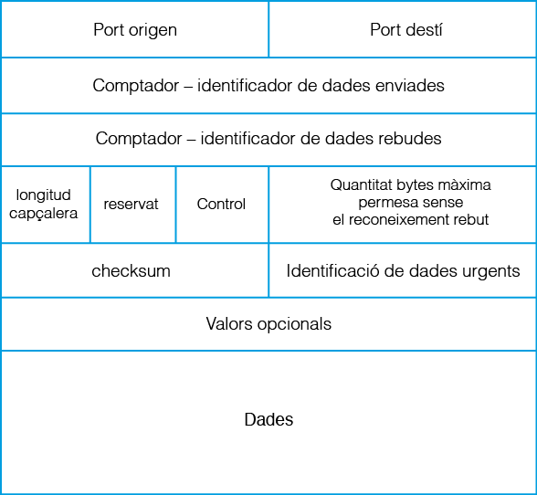
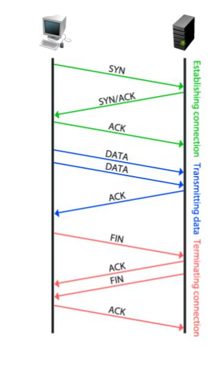
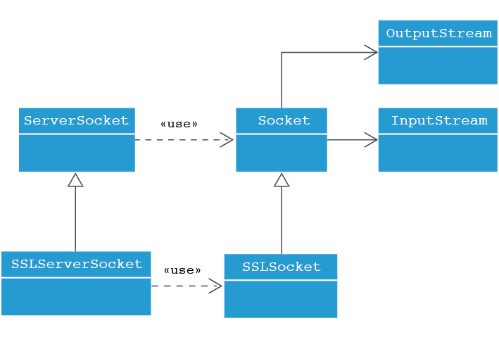
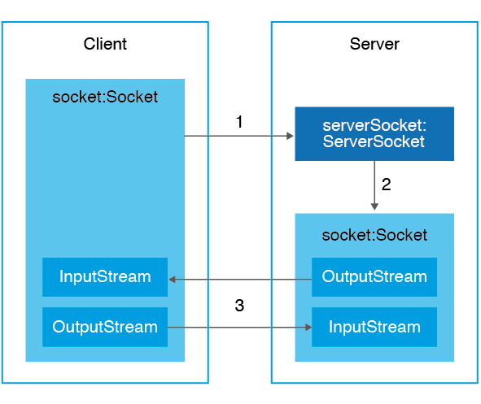

#### 3.3.3.4 TCP (Transmission Control Protocol) 

És un protocol orientat a connexió, és un protocol més sofisticat i complex que l’UDP pensat per a la intercomunicació entre dos interlocutors. Això significa que dos processos que es vulguen comunicar entre sí, requeriran abans establir una connexió.  

És important destacar que afegeix mecanismes de control sobre el nivell inferior (el protocol IP) que li confereixen una capa de seguretat addicional. És per això pel que el protocol TCP tot i que és més lent que el protocol UDP, és l’escollit per aplicacions que requerisquen una fiabilitat en la transmissió de les dades.

Els paquets de dades enviats per TCP s’anomenen **segments** i es transmeten en forma de seqüència de bytes.

La característica que el defineix i diferencia respecte a UDP és la gestió de la transmissió, la qual implica:

* Realitzar un control d’errors de la informació enviada de forma que descarta els segments erronis que puguen haver quedat corromputs o duplicats.  
* Gestionar la retransmissió dels paquets de dades que no han arribat o han arribat en errades forçant el reenviament.  
* Garantitzar l’arribada dels segments ordenada, conforme s’han enviat.  
* Permetre la comunicació en els dos sentits, és bidireccional, és a dir, és ***full-duplex***.

Amb el control anterior, es garanteix que qualsevol segment de dades enviat, serà rebut a l’altre extrem de la connexió en l’ordre correcte i lliure de qualsevol error. En eixe sentit, per tal d’assegurar la fiabilitat de les dades, el protocol estableix que per cada segment enviat des d’un o altre dispositiu, el receptor contestarà amb un senyal especial de reconeixement (flag **ACK**) que indique a l’emissor que les dades del segment han arribat amb èxit. El senyal de reconeixement inclou un valor que identifica la porció de bytes rebuda en segments fent servir el valor del comptador de bytes. 

D’aquesta manera emissor i receptor poden anar interpretant si la transmissió va tenint èxit, o si cal fer un nou reenviament d’algun segment, perquè no s’ha rebut el seu senyal de reconeixement (pèrdua parcial d’alguns segments) o perquè s’ha rebut un reconeixement amb un identificador repetit (’arribada corrupta de dades).

En qualsevol cas, és el propi protocol el qui s’encarrega de la gestió dels segments alliberant a l’usuari d’aquesta tasca.

El protocol TCP manté un diàleg permanent entre l’emissor i el receptor, en el qual ambdós extrems s’informen d’allò que van enviant i rebent. La connexió s’inicia amb una petició de connexió i es manté oberta (ambdós dispositius s’escolten mútuament) fins que un dels dos envie un senyal per finalitzar la connexió.

##### **Segment** 

Per a fer un enviament a TCP, cal adjuntar a les dades una **capçalera TCP**.

Tota capçalera TCP cal que incloga, entre altres:

* ***Port origen*** del segment (2 bytes).

* ***Port destí*** del segment  (2 bytes).

* ***Comptador dades enviades*** (4 bytes), serveix per a identificar el número de segment enviat i per tant l’ordenació dels diferents segments.

* ***Comptador dades rebudes*** (4 bytes), serveix per a confirmar la correcta arribada de les dades del segment anteriorment enviat.

* ***Longitud capçalera*** del segment,  només la capçalera, la longitud de les dades es pot determinar usant l’identificador/comptador de dades enviades. .

* ***Control***, permet donar informació extra de les dades de la capçalera (*flags* que regulen la comunicació)  o de l’estat de la transmissió.

* ***Checksum*** de la capçalera (2bytes), és un valor de comprovació per a realitzar la verificació de la coherència de la capçalera.

{width=50%}

Amb el detall de la capçalera, i centrant-nos en el camp de Control, s’està en condicions d’explicar el funcionament d’una connexió TCP.

L’establiment d’una connexió TCP entre l’emissor i el receptor consisteix en:

* Un procés receptor que es quede escoltant sol·licituds de connexió en un sòcol TCP lligat a un port X concret, 

* Un procés emissor distint, inicia envia la sol·licitud de connexió (segment amb el flag **SYN** al camp de Control) a eixe port concret X des d’un port temporal Y.

* Quan el procés receptor reb la sol·licitud, l’accepta reservant un port temporal Z per a la comunicació amb el procés emissor i enviant-li un segment amb els flags **SYN** (enviament de petició de connexió en sentit contrari) i **ACK** (confirmació de la recepció de la petició de connexió de l’emissor) al camp de Control indicant-li el nou port de connexió Z per a la connexió.

* Amb l’enviament d’un tercer segment del procés emissor amb el flag **ACK** (confirmació de la recepció de la petició de connexió del receptor) al camp de Control queda establida la connexió entre el port temporal del procés emissor X i el port temporal Z del procés receptor.

* Aquesta connexió o diàleg, quedarà obert fins que algun dels dos extrems decidisca tancar comunicació amb l’enviament del flag **FIN** al camp de Control del segment. Així l’altre extrem, en rebre el flag, sabrà que cal tancar connexió.

{width=50%}

Amb el diàleg comentat anteriorment, s’estableix una connexió bidireccional perquè **s’estableix dos canals de comunicació en cada connexió**, cada un en un sentit diferent. És a dir, es manté un canal de transmissió des del dispositiu A al dispositiu B independentment del canal de transmissió que vaja del dispositu B al dispositiu A. En la pràctica això implica que cada dispositiu manté un registre del qual envia i rep de forma independent.

##### **Classes JAVA per a sócols TCP** 

Els sòcols orientats a connexió fan servir el protocol TCP.

Com s’ha dit amb anterioritat, el protocol TCP defineix que abans de començar la transmissió de dades cal fer una petició de connexió que l’altra part haurà d’acceptar. Una vegada acceptada la connexió, en ambdós costats es reservarà un port de xarxa exclusivament per a la transmissió de dades en qualsevol dels dos sentits. Recordeu que TCP és un protocol que defineix una comunicació full-duplex exclusiva entre dos dispositius.

El llenguatge Java té una manera pròpia d’implementar aquestes característiques. Dels dos dispositius a posar en contacte, un d’ells farà el paper de **servidor** esperant la demanda d’algun dispositiu, que jugarà el paper de **client**.

Les classes implicades poden veure’s a aquesta jerarquia de classes:

{width=40%}

**ServerSocket** realitza el procés d’establiment de la connexió a l’estar escoltant fins que un client faça una petició que gestionarà amb els mètodes.

**Socket** representa un extrem de la comunicació, s’usa una vegada ja s’ha establit la connexió per a l’enviament o recepció de dades.

**SSLServerSocket i SSLSocket** ofereixen la mateixa funcionalitat que **ServerSocket** i **Socket** respectivament però estan especialitzades en transmetre de forma segura usant un protocol de seguretat anomenat SSL.

#### ServerSocket ([API](https://docs.oracle.com/javase/10/docs/api/java/net/ServerSocket.htmlagramSocket.html))

Aquesta classe és emprada només per aquella aplicació que vaja a desenvolupar el rol de servidor a la comunicació, és a dir, es crearà una única instància de la classe ServerSocket específicament per atendre peticions de  clients a un determinat port que caldrà especificar. 

El mètode més important de la classe és el mètode **accept()**, el qual fa que el programa quede a l’espera de peticions, quan es reba una petició, s’acceptarà la connexió i generarà una instància de tipus Socket per mantenir la comunicació full-duplex i que correspon al valor retornat pel mètode. La creació d’instància del Socket a la banda del servidor es troba automatitzat i s’obté com a retorn del mètode **accept**.

Amb el Socket retornat pel mètode, queda establida la comunicació amb el client des d’aquest nou port fins que es finalitze la comunicació.

| Mètodes de ServerSocket | Descripció |
| ----- | ----- |
| ServerSocket() ServerSocket​(int port) ServerSocket​(int port, int backlog) ServerSocket​(int port, int backlog, InetAddress bindAddr) | Constructors de ServerSocket. Si no s’especifica un port, caldrà definir-lo més endavant amb el mètode bind() Si no s’indica una IP, es vincula a totes les interfícies actives. El sencer backlog correspon al tamany màxim de la cua de peticions de connexió de clients pendents de ser ateses. |
| Socket	accept() | Acció de quedar a l’espera d’una petició de connexió d’un client. Una vegada rebuda, es acceptada  retornant un nou Socket creat especificament per a la comunicació amb el client. |
| void	bind​(SocketAddress endpoint) void	bind​(SocketAddress endpoint, int backlog) | Associa el ServerSocket a un SocketAddress (IP i port) on escoltar peticions. |
| void	close() | Tanca el ServerSocket. |

##### Socket ([API](https://docs.oracle.com/javase/10/docs/api/java/net/Socket.html))

La classe Socket representa un extrem de la comunicació TCP, el qual requereix l’especificació de l’adreça i el port amb el que caldrà comunicar-se i disposa de mètodes per a l’enviament i recepció de dades. Cada extrem de la comunicació necessita d’una instància de la classe Socket.

El detall de la classe  Socket pot veure’s al següent quadre resum:

| Mètodes de Socket | Descripció |
| ----- | ----- |
| Socket() Socket​(String host, int port) Socket​(InetAddress address, int port)  | Constructors de Socket. Si no s’especifica un port, caldrà definir-lo més endavant amb el mètode bind() Si no s’indica una IP, es vincula a totes les interfícies actives. |
| InputStream	  getInputStream() | Retorna el InputStream associat al sòcol, des d’aquest es pot rebre informació enviada des de l’altre extrem de la comunicació. |
| OutputStream	  getOutputStream() | Retorna el OutputStream associat al sòcol, des d’aquest es pot enviar informació cap a l’altre extrem de la comunicació. |
| boolean	isInputShutdown() | Retorna si el flux  d’entrada continua obert. |
| boolean	isOutputShutdown() | Retorna si el flux  d’eixida continua obert. |
| void	shutdownInput() | Envia el senyal de finalizació de la connexió per al flux d’entrada. |
| void	shutdownOutput() | Envia el senyal de finalizació de la connexió per al flux d’eixida. |
| void	bind​(SocketAddress bindpoint) | Associa el Socket a un SocketAddress (IP i port). |
| InetAddress	getLocalAddress() | Retorna l’adreça IP local per al sòcol. |
| InetAddress	getInetAddress() | Retorna l’adreça IP remota per al sòcol. |
| void	close() | Tanca el Socket. |

Per a la transmissió de dades es fa servir el concepte de **flux de dades**. Es considera que les dades flueixen de forma contínua i seqüencial des de l’origen fins al destí.

Els objectes de la classe Socket contenen associats dos fluxos de dades. A través d’un d’ells es rebran les dades (flux d’entrada) i a través de l’altre s’enviaran (flux d’eixida). En aplicacions client servidor, el flux d’eixida del servidor equival al flux d’entrada del client i el flux d’entrada del servidor coincidirà amb el d’eixida del client.

Aquestos fluxos bidireccionals es poden obtindre amb els mètodes:

* **getInputStream()**, invocat per retornar el flux d’entrada del Socket i poder rebre dades.

* **getOutputStream()**, invocat per retornar el flux d’eixida  del Socket i poder enviar dades.

S’usaran els mètodes propis del fluxos per enviar o rebre dades a través d’ells. L’enviament a través del flux de sortida d’un dels sòcols implicarà la recepció de les mateixes dades enviades a través del flux d’entrada de l’altre sòcol.

##### **Programació d’aplicacions Client i Servidor en TCP** 

Amb tot el comentat anteriorment, ja s’està en disposició de veure el procediment de comunicació entre dos dispositius usant TCP.

Com s’ha vist i es pot deduir, la comunicació entre els dos dispositius no és exactament igual, un dels dos caldrà que desenvolupe el rol de Servidor (aquell que espera una petició TCP) i l’altre adopte el rol de Client (aquell que inicia la comunicació amb una petició TCP).

De forma esquemàtica, el procediment seguit per connectar un client TCP amb un servidor TCP de Java, es pot resumir al següent gràfic:

{width=40%}

Els passos del gràfic son:

1. El Client crea un sòcol per demanar connectar-se a l’adreça en la qual es troba el servidor i al port on escolta una instància de ServerSocket del servidor.

2. El ServerSocket accepta la connexió i crea un sòcol a la part del servidor amb dos canals, un d’entrada i un de sortida.

3. l’ InputStream (flux d’entrada) del sòcol de la part client es troba connectat a l’ OutputStream (flux de sortida) del sòcol de la part servidor i el seu flux d’entrada connecta amb el flux de sortida del sòcol del client. 

   D’aquesta manera és possible la comunicació en ambdues direccions amb la qualitat exigida pel protocol TCP.

4. En finalitzar la comunicació cal tancar els sòcols en ambdós costats.

De forma més global, qualsevol aplicació TCP, inclou part servidora i part client,  seguirà el següent cicle de vida:

 

A continuació es planteja un exemple que il·lustra una comunicació TCP.


!!! tip "**Exemple 3.5**:"
    **Implementa un programa al paquet Exemple3\_05\_HolaAdeuTCP que implemente una breu comunicació entre un client TCP (Hola.java)  i un servidor TCP (Adeu.java) que aten peticions al  port 15000\. El client envia el text “Hola” i el servidor li contesta amb el text “Adeu”.**
    
Al codi s’observa que s’han emprat fils per implementar la lògica del client i servidor TCP

***Main.java***
```java
package Exemple3_05_HolaAdeuTCPu;


import java.io.IOException;
import java.net.InetAddress;


public class Main {
   static final int serverPort=15000;
   public static void main(String[] args) {


       try {
           System.out.println("Programa que un client TCP envia la paraula 'Hola' al Servidor"
                   + "\n i el Servidor visualitza el text a més de respondre al Client amb 'Adeu'"
                   + "\n visualitzant-ho tot per pantalla");
           System.out.println("========================================================================");


           Thread server = new Thread(new Adeu(serverPort),"servidorADEU");
           server.start();
           Thread.sleep(500);


       Thread client = new Thread(new Hola(InetAddress.getByName("127.0.0.1"), serverPort),"clientHOLA");
           client.start();


           server.join();
           client.join();
       }catch (InterruptedException | IOException e) {
           // TODO Auto-generated catch block
           e.printStackTrace();
       }
   }//main
}//class

```

A la classe *Main*, es creen els dos fils passant-los com a arguments o bé el port on escoltar peticions en el cas del servidor o bé el port més la IP del servidor en el cas del Client

***Adeu.java*** *(Servidor TCP)*  
```java
package Exemple3_05_HolaAdeuTCP;


import java.io.DataInputStream;
import java.io.DataOutputStream;
import java.io.IOException;
import java.io.InputStream;
import java.io.OutputStream;
import java.net.ServerSocket;
import java.net.Socket;


public class Adeu implements Runnable{
   //Atributes
   private ServerSocket serverSocket;
   private Socket socketToClient;
   private int serverPort;
   DataInputStream fluxIn;
   DataOutputStream fluxOut;


   //Constructor
   public Adeu(int portToListen) throws IOException {
       this.serverPort = portToListen;
       // ServerSocket
       this.serverSocket = new ServerSocket(portToListen);
       socketToClient = null;
       fluxIn = null;
       fluxOut = null;
   }


   public void run() {
       String cadenaEnviar = "Adeu";
       String data;
       try {


           System.out.println("["+Thread.currentThread().getName()+"]  Esperant peticions al port " + serverPort + "...");


           // Socket esperant peticio
           socketToClient = serverSocket.accept();
           System.out.println("["+Thread.currentThread().getName()+"]  Atenent al Client al port "+socketToClient.getPort());


           InputStream in = socketToClient.getInputStream();// Obtenció del flux de LECTURA
           fluxIn = new DataInputStream(in);                // Conversio a DataInputStream
           data = fluxIn.readUTF();                        //  lectura del socol Client


           // Mostrant dades rebudes
           System.out.println("["+Thread.currentThread().getName()+"] Dades rebudes al Servidor: " + data);


           OutputStream out = socketToClient.getOutputStream();// Obtenció del flux d'ESCRIPTURA
           fluxOut = new DataOutputStream(out);                // Conversio a DataOutputStream
           System.out.println("["+Thread.currentThread().getName()+"] Dades enviades al Client: " + cadenaEnviar);
           fluxOut.writeUTF(cadenaEnviar);                         // escriptura al socol Client


           // Tancament del socol amb el Client
           if (socketToClient != null && !socketToClient.isClosed()) {
               //Tancament de flux lectura
               if (!socketToClient.isInputShutdown()) {
                   System.out.println("["+Thread.currentThread().getName()+"] Tancant flux lectura...");
                   socketToClient.shutdownInput();
               }
               //Tancament de flux escriptura
               if (!socketToClient.isOutputShutdown()) {
                   System.out.println("["+Thread.currentThread().getName()+"] Tancant flux escriptura...");
                   socketToClient.shutdownOutput();
               }
               socketToClient.close();
           }


           // Tancament del socol Servidor
           if (!serverSocket.isClosed())
               System.out.println("["+Thread.currentThread().getName()+"] Tancant socol al port "+ serverPort);
               serverSocket.close();


           System.out.println("["+Thread.currentThread().getName()+"]  Finalitzat");
       } catch (IOException e) {
           // TODO Auto-generated catch block
           e.printStackTrace();
       }
   }//run
}//class
```

Destacar que en finalitzar la comunicació, a més de tancar el sòcol específic per a la conversa amb el client, caldrà també tancar el sòcol on el servidor escolta peticions abans finalitzar exemple.

***Hola.java*** *(Client TCP)*  
```java
package Exemple3_05_HolaAdeuTCP;


import java.io.DataInputStream;
import java.io.DataOutputStream;
import java.io.IOException;
import java.io.InputStream;
import java.io.OutputStream;
import java.net.InetAddress;
import java.net.Socket;


public class Hola implements Runnable{
   //Atributes
   private InetAddress IPServer;
   private Socket socketToServer;
   private int portToServer;
   DataInputStream fluxIn;
   DataOutputStream fluxOut;


   //Constructor
   public Hola(InetAddress IPServer, int portToWrite) throws IOException {
       this.IPServer = IPServer;
       this.portToServer = portToWrite;
       this.socketToServer = new Socket(IPServer, portToServer);
       fluxIn = null;
       fluxOut = null;
   }


   public void run() {
       String cadenaEnviar = "Hola";


       try {
           // Obtenció del flux d'ESCRIPTURA
           OutputStream out = socketToServer.getOutputStream();
           fluxOut = new DataOutputStream(out);    // Conversio a DataOutputStream
           System.out.println("["+Thread.currentThread().getName()+"] Dades enviades al Servidor: " + cadenaEnviar);
           fluxOut.writeUTF(cadenaEnviar);             // escriptura al socol del Servidor


           // Obtenció del flux de LECTURA
           InputStream in = socketToServer.getInputStream();
           fluxIn = new DataInputStream(in);       // Conversio a DataInputStream
           System.out.println("["+Thread.currentThread().getName()+"] Dades rebudes al Client: " + fluxIn.readUTF());


           // Tancament del socol amb el Servidor
           if (socketToServer != null && !socketToServer.isClosed()) {
               if (!socketToServer.isInputShutdown()) {
                   System.out.println("["+Thread.currentThread().getName()+"] Tancant flux lectura...");
                   socketToServer.shutdownInput();
               }
               if (!socketToServer.isOutputShutdown()) {
                   System.out.println("["+Thread.currentThread().getName()+"] Tancant flux escriptura...");
                   socketToServer.shutdownOutput();
               }
               System.out.println("["+Thread.currentThread().getName()+"] Tancant socol");
               socketToServer.close();


               System.out.println("["+Thread.currentThread().getName()+"]  Finalitzat");
           }
       } catch (IOException e) {
           // TODO Auto-generated catch block
           e.printStackTrace();
       }
   }//run 
}//class 

```

!!! note "**Activitat Proposada 3.6**"
    **Realitza un programa al paquet Act3\_06\_Servidor3Clients que realitze un breu diàleg orientat a connexió entre un programa servidor i tres clients que intercanvien cadenes d'informació. Cada vegada que es presenta un client, el servidor el saludarà enviant-li la frase "Hola client N" (on N és el número de client) a mostrar per pantalla el client. Este servidor sols atendrà fins a tres client finalizant la seua execució després i mostrant a cada petició el text "Atenent al client N".**

    Exemple: 

    | **SERVIDOR** | **CLIENT 1** | **CLIENT 2** | **CLIENT 3** |    
    | ---- | ---- | ---- | ---- | 
    |[SERVIDOR]. Esperant peticions al port 11000… | | | |
    | | [CLIENT1] Iniciant comunicació amb el servidor al port 11000…| | |  
    |[SERVIDOR] Atenent al client1. |[CLIENT1] Missatge rebut del servidor: Hola client 1| |[CLIENT3] Iniciant comunicació amb el servidor al port 11000… |
    |[SERVIDOR] Atenent al client3. | [CLIENT1] Finalitzant  comunicació amb el servidor…  |[CLIENT2] Iniciant comunicació amb el servidor al port 11000…| [CLIENT3] Missatge rebut del servidor: Hola client 2 |
    |[SERVIDOR] Atenent al client2. | | [CLIENT2] Missatge rebut del servidor: Hola client 3 | [CLIENT3] Finalitzant  comunicació amb el servidor…|
    |[SERVIDOR]. Finalitza amb el tancament del port 11000… |     |[CLIENT2] Finalitzant  comunicació amb el servidor…  | |  
   
    

